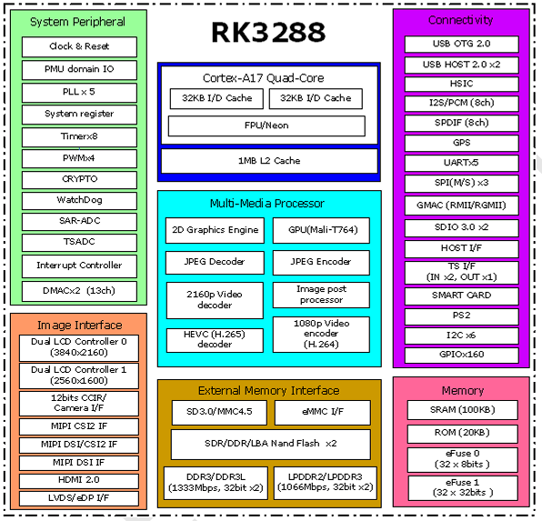

# RK3288

## Key features

- Quad-core Cortex-A17 up to 1.8GHz(available for RK3288-C/CG/K)
- Mali-T764 GPU
- Dual-channel DDR3/DDR3L/LPDDR2/LPDDR3
- 4K UHD H265/H264
- BT.2020/BT.709
- H264 encoder
- TS in/CSA 2.0
- USB 2.0
- HDMI 2.0 with HDCP 2.2
- MIPI/eDP/LVDS/RGMII
- TrustZone/TEE/DRM

## Specification

| Specification | Details |
| :--- | :--- |
| **Process** | • 28nm |
| **CPU** | • Quad-Core Cortex-A17, up to 1.8GHz (available for RK3288-C/CG/K)• Mali-T760 GPU, Supports AFBC (ARM Frame Buffer Compression) |
| **GPU** | • Support OpenGL ES 1.1/2.0/3.1, OpenCL, DirectX9.3• High performance dedicated 2D processor |
| **Multi-Media** | • 4K 10bits H265/H264 video decoders• 1080P other video decoders (VC-1, MPEG-1/2/4, VP8)• 1080P video encoder for H.264 and VP8• Video post processor: de-interlace, de-noise, enhancement for edge/detail/color |
| **Display** | • Support RGB/Dual VDUs/Dual MIPI-DSI/eDP interface, up to 3840*2160 resolution• HDMI 2.0 for 4K@60Hz with HDCP 1.4/2.2 |
| **Security** | • ARM TrustZone (TEE), Secure Video Path, Cipher Engine, Secure boot |
| **Memory** | • Dual-channel 64bit DDR3-1333/LPDDR2-1066• Support MLC NAND, eMMC 4.51 |
| **Connectivity** | • Embedded 13M ISP, MIPI CSI-2 and DVP interface• Dual SDIO 3.0 interface• TS in/CSA2.0, support DTV function• Embed HDMI, Ethernet MAC, S/PDIF, USB2.0, I2C, UART, SPI, I2S |
| **Package** | • BGA636, 19x19, 0.65mm pitch |
| **State** | • MP Now |

