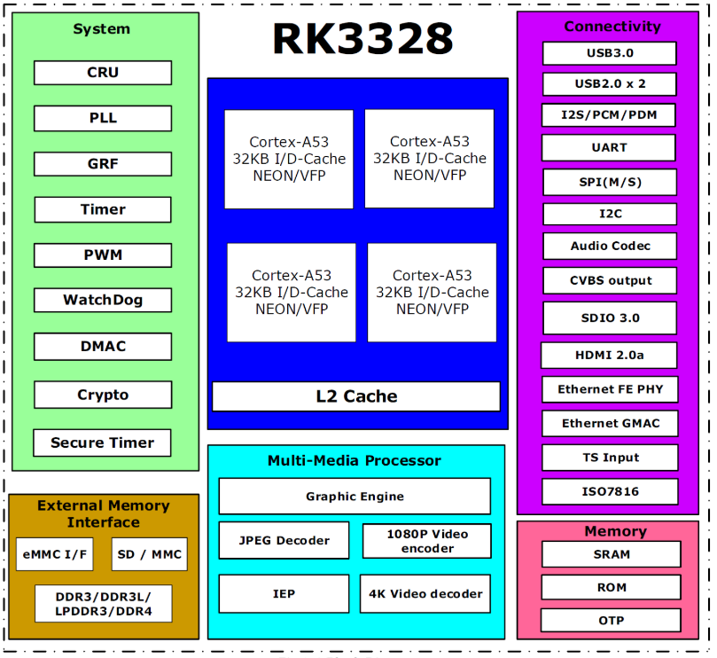

# RK3328

## Key features

- Quad-core Cortex-A53
- Mali-450MP2 GPU
- DDR3/DDR3L/LPDDR3/DDR4
- 4K UHD H265/H264/VP9
- HDR10/HLG
- H265/H264 encoder
- TS in/CSA 2.0
- USB3.0/USB2.0
- HDMI 2.0a with HDCP 2.2
- FE PHY/Audio DAC/CVBS/RGMII
- TrustZone/TEE/DRM

## Specification

| Specification | Details |
| :--- | :--- |
| **CPU** | • Quad-Core Cortex-A53 |
| **GPU** | • Mali-450MP2, Support OpenGL ES 1.1/2.0 |
| **Memory** | • 32bit DDR3-1866/DDR3L-1866/LPDDR3-1866/DDR4-2133• Support eMMC 4.51, SDCard, SPI Flash |
| **Multi-Media** | • 4K VP9 and 4K 10bits H265/H264 video decode, up to 60fps• 1080P other video decoders (VC-1, MPEG-1/2/4, VP8)• 1080P video encoder for H.264 and H.265• Video post processor: de-interface, de-noise, enhancement for edge/detail/color• Support HDR10, HLG HDR, Support conversion between SDR and HDR |
| **Display** | • HDMI 2.0a for 4K@60Hz with HDCP 1.4/2.2• Support conversion between Rec.2020 and Rec.709 |
| **Security** | • ARM TrustZone (TEE), Secure Video Path, Cipher Engine, Secure boot |
| **Connectivity** | • I2C/UART/SPI/SDIO3.0/USB2.0/USB3.0• 8 channels I2S/PDM interface, supports 8 channels Mic array• Embedded CVBS, HDMI, Ethernet MAC and PHY, S/PDIF, Audio DAC• TS in/CSA2.0, support DTV function |
| **Package** | • BGA316 14x14, 0.65mm pitch |
| **state** | • MP Now |

