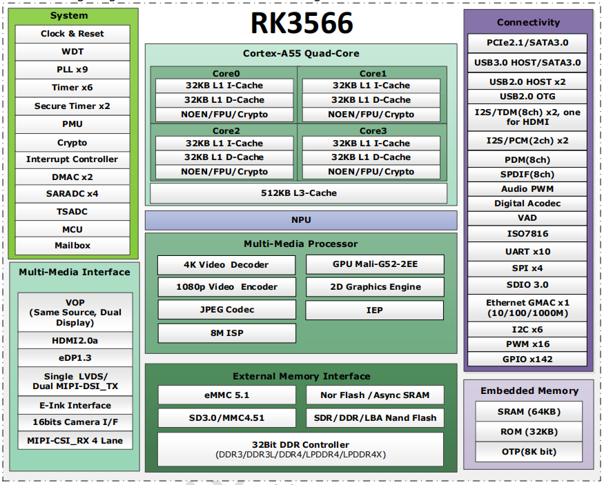

# RK3566

## Key features

- Quad-core Cortex-A55
- Mali-G52 GPU
- 1TOPS NPU
- LPDDR4/LPDDR4X/DDR4/DDR3/DDR3L/LPDDR3
- 4KP60 H.265/H.264/VP9 video decoder
- 1080P60 H.264/H.265 video encoder
- 8M ISP
- Single Display, LVDS/MIPI-DSI/RGB/eDp/HDMI2.0/EBC
- 1x8ch I2S/TDM, 1x8ch PDM, 2x2ch I2S

## Specification

| Specification | Details |
| :--- | :--- |
| **CPU** | • Quad-Core ARM Cortex-A55 |
| **GPU** | • ARM G52 2EE• Support OpenGL ES 1.1/2.0/3.2, OpenCL 2.0, Vulkan 1.1• High performance dedicated 2D processor |
| **Display** | • Support eDP/HDMI/MIPI/LVDS/EBC• Support 4K 60fps H.265/H.264/VP9 decoder |
| **Multi-Media** | • Support 1080P 60fps H.265/H.264 encoder• Support 8M ISP |
| **NPU** | • Support 1T |

