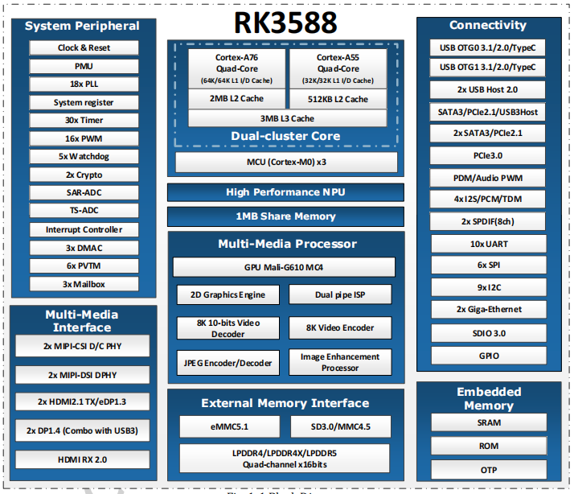

# RK3588

## Key features

- 8nm process, quad-core Cortex-A76 + quad-core Cortex-A55
- ARM Mali-G610 MC4 GPU, embedded high performance 2D image acceleration module
- 6.0 TOPs NPU， enable various AI applications
- 8K video codec ,8K@60fps display out
- Rich Display Interface, multi-screen display
- Super 32MP ISP with with HDR&3DNR, multi-camera inputs
- Rich high-speed interfaces (PCIe, TYPE-C，SATA, Gigabit ethernet) Android and Linux OS

## Specification

| Specification | Details |
| :--- | :--- |
| **CPU** | • Quad core Cortex-A76 + Quad-core Cortex-A55 |
| **GPU** | • ARM Mali-G610 MC4• OpenGL ES 1.1/2.0/3.1/3.2• Vulkan 1.1, 1.2• OpenCL 1.1,1.2,2.0• Embedded high performance 2D image acceleration module |
| **NPU** | • 6TOPS NPU, triple core, support int4/int8/int16/FP16/BF16/TF32 acceleration |
| **Video Codec** | • H.265/H.264/AV1/AVS2 etc. multi video decoder, up to 8K@60fps• 8K@30fps video encoders for H.264/H.265 |
| **Display** | • Built-in eDP/DP/ HDMI2.1/MIPI display interface, support multiple display engine max to 8K@60fps• Supports multi-screen display with 8K60FPS max |
| **Video in and ISP** | • Dual 16M Pixel ISP with HDR&3DNR• Multiple MIPI CSI-2 and DVP interface, support HDMI 2.0 RX• Support HDMI2.0 input with 4K60FPS max |
| **High speed interface** | • PCIe3.0/PCIe2.0/SATA3.0/RGMI/TYPE-C/USB3.1/USB2.0 |

