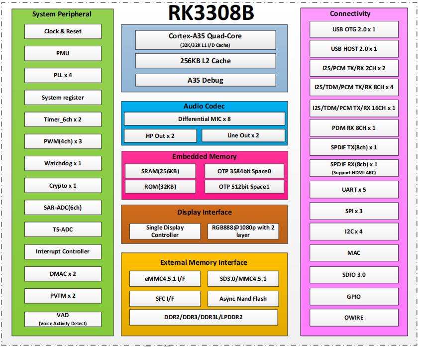

# RK3308

## 主要特性

- Quad-core Cortex-A35 up to 1.3GHz
- DDR3/DDR3L/DDR2/LPDDR2
- Audio CODEC with 8x ADC , 2x DAC
- Hardware VAD(Voice Activation Detection)
- RGB/MCU display interface
- 2x8ch I2S/TDM, 1x8ch PDM, 1x2ch I2S

## 详细参数 

| Specification | Details |
| :--- | :--- |
| **CPU** | • Quad-Core ARM Cortex-A35, up to 1.3GHz |
| **Audio** | • Embedded Audio CODEC with 8xADC, 2xDAC |
| **Display** | • Support RGB/MCU, resolution up to 720P |
| **Memory** | • 16bits DDR3-1066/DDR3L-1066/DDR2-1066/LPDDR2-1066• Support SLC NAND, eMMC 4.51, Serial Nor FLASH |
| **Connectivity** | • Support 2x8ch I2S/TDM, 1x8ch PDM, 1x2ch I2S/PCM• Support SPDIF IN/OUT, HDMI ARC• SDIO3.0, USB2.0 OTG, USB2.0 HOST, I2C, UART, SPI, I2S |

