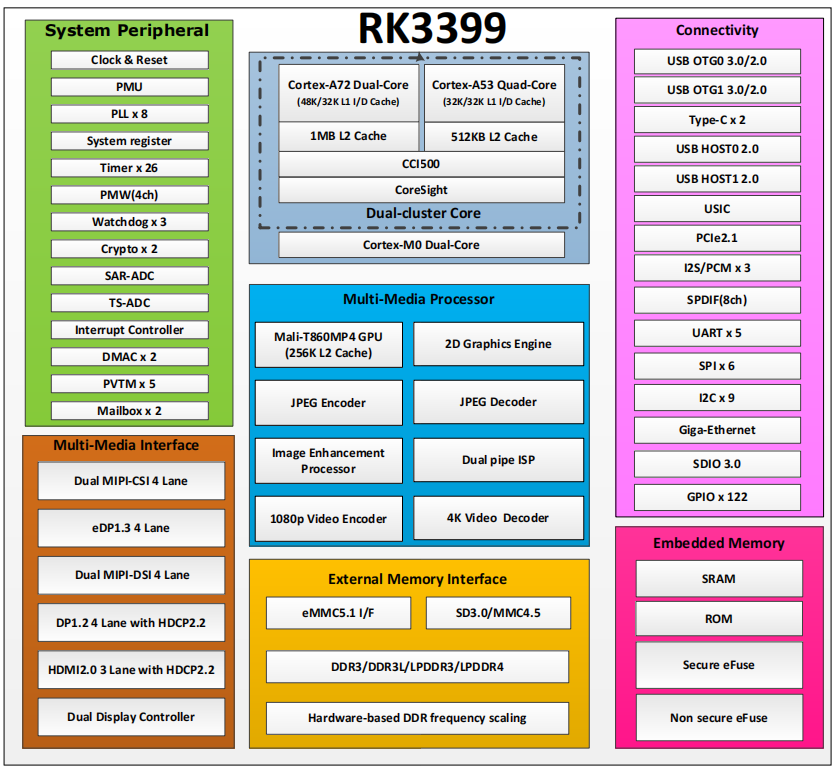

# RK3399

## 主要特性

- Dual-core Cortex-A72 up to 1.8GHz, Quad-core Cortex-A53 up to 1.4GHz
- Mali-T860 GPU
- Dual-channel DDR3/DDR3L/LPDDR3/LPDDR4
- 4K UHD H265/H264/VP9
- HDR10/HLG
- H264 encoder
- Dual MIPI CSI and ISP
- Dual USB Type-C and USB 2.0
- HDMI 2.0a with HDCP 2.2
- MIPI/eDP/RGMII/DP/PCIe
- TrustZone/TEE/DRM

## 详细参数 

| Specification | Details |
| :--- | :--- |
| **CPU** | • Quad Cortex-A53 + MCU |
| **GPU** | • 2D Graphics Engine |
| **NPU** | • 3 TOPS |
| **Storage Interface** | • 32bit DDR3L/DDR4/ LP3/LP4/LPAX, eMMC 4.51 |
| **Video Encoder & Decoder** | • Support up to 4K 45fps video encoding• Support H.264/H.265 |
| **Video Input Interface** | • Support 2 x 4lane/ 4 x 2lane/ Thermal Imaging MIPI-CSI Interface• Support DVP interface with BT.656/BT.1120 |
| **Video Output Interface** | • Support 4-lane MIPI DSI interface, up to 1080p@60fps output |
| **ISP** | • 12M@30fps |
| **Audio Interface** | • Integrated Audio codec, 2 * 32-bit ADC, and 16 bit DAC |
| **Peripheral Interface** | • USB3.0 DRD/ USB 2.0 host/ 2xSDIO3.0/ 2xCAN/ DSMC/ RGMII |
| **Package** | • FCCSP 14*14mm |

