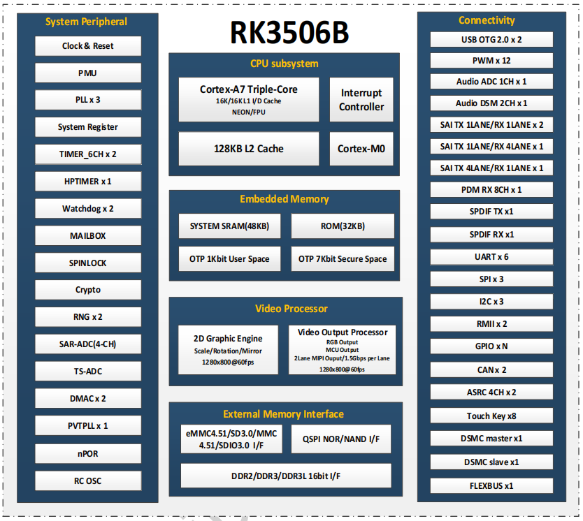

# RK3506

## 主要特性

- 高性能 SoC 芯片
- 具备三核高主频ARM CPU
- 丰富的外设接口，包含双USB OTG，双以太网，矩阵化功能IO以及高速DSMC接口
- 可应用于IP话机，HMI显示控制，PLC工业控制，扫地机器人，语音模组等产品

## 详细参数 

| Specification | Details |
| :--- | :--- |
| **CPU** | • Triple Core Cortex-A7 |
| **Storage Interface** | • 16bit DDR2/3/3L (RK3506B/ RK3506J)/ 64MB DDR2 (RK3506G1)/ 128MB DDR3L (RK3506G2) |
| **Audio Interface** | • ADC/ 2xDSM/ 3xSAI/ 8xPDM |
| **Peripheral Interface** | • 2xUSB2.0 OTG/ 3xSPI/ 6xUART/ 3xI2C/ 2xCAN/ 12xPWM/ 4xSARADC/ 2xRMII/ FLEXBUS/ DSMC |

