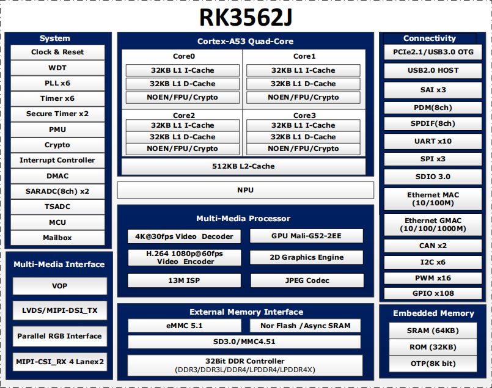

# RK3562J

## 主要特性

- Quad-core Cortex-A53 up to 2.0GHz
- Mali-G52 GPU
- 1TOPS NPU
- LPDDR4/LPDDR4X/DDR4/DDR3/DDR3L/LPDDR3
- 4KP30 H.265/VP9, 1080P60 H.264 video decoder
- 1080P60 H.264 video encoder
- 13M ISP
- LVDS/MIPI-DSI/RGB
- 3x SAI with I2S/PCM/TDM, 1x8ch PDM
- USB3.0 OTG, USB2.0 HOST, PCIE2.1, RGMII + RMII

## 详细参数 

| Specification | Details |
| :--- | :--- |
| **CPU** | • Quad-Core ARM Cortex-A53, up to 2.0GHz |
| **GPU** | • ARM G52 2EE• Support openGL ES 1.1/2.0/3.2, OpenCL 2.0, Vulkan 1.1• High performance dedicated 2D processor |
| **NPU** | • Support 1T |
| **Video Codec** | • Support 4K 30fps H.265/VP9 and 1080P 60fps H.264 decoder• Support 1080P 60fps H.264 encoder• Support 13M ISP |
| **Display** | • Single display• Support LVDS/MIPI-DSI/RGB |
| **Interface** | • Support USB3.0 OTG, USB2.0 HOST, PCIE2.1, RGMI + RMII |

