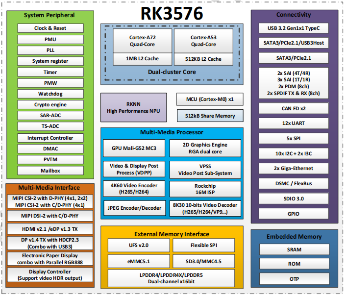

# RK3576

## 主要特性

- ARM 64位高性能八核通用处理器，丰富的PCIE/USB3.0/SATA/GMAC等各类高速及CAN FD/DSMC/UART/SPI/I2C/I3C等低速扩展接口，计算及扩展能力通用性强，一个平台可快速部署多种产品。
- 内置6TOPS*自研高效率AI处理器单元，满足各类人工智能应用。
- 丰富的显示接口，高效率GPU处理器，支持3个显示屏异显（每屏内容不同）。
- 强大的影像感知、视频编解码及音频处理能力，整合视觉和语音识别交互。
- 标准Android、Linux SDK支持，适配各类国产OS。

## 详细参数 

| Specification | Details |
| :--- | :--- |
| **CPU** | • Quad-Core Cortex-A72 + Quad-Core Cortex-A53, Max Frequency 2.2GHz |
| **GPU** | • ARM G52 MC3 |
| **NPU** | • 6TOPS* RKNN |
| **PQ** | • Rockchip dedicated Picture Quality Engine (HDR, ACM, DCI, etc.) |
| **Display** | • DisplayPort/MIPI/eDP/HDMI/RGB/EBC, utiple displays with different sources. |
| **Memory** | • 32bits LPDDR4/4x, LPDDR5• UFS 2.0 (2-lane), eMMC 5.1, SPI Nor/Nand |
| **Video** | • 8K30 H.265/ VP9/ AV1/ AVS2 Decoder• 4K60 H.264 |
| **Camera** | • 16M ISP with HDR (up to 120dB)• MIPI CSI-2 (DPHY=1*4-lane, DPHY=2*4-lane/4*2-lane), DVP |
| **Interface** | • 5 SAI interfaces (total 7-tx and 7-rx lanes, each lane supports 8-ch I2S/PCM/TDM)• 2 PCM (2*8-ch)• 2 S/PDIF TX and 1 S/PDIF RX• ASRC• USB 3.0 DRD (supports Alt mode with DP)• Combo USB3.0 DRD/PCIe 2.1 RC/SATA3• Combo PCIe 2.1 RC/SATA3• RGMII2• CAN FD, DSMC• UART, SPI, PWM, I2C, SAR-ADC |

