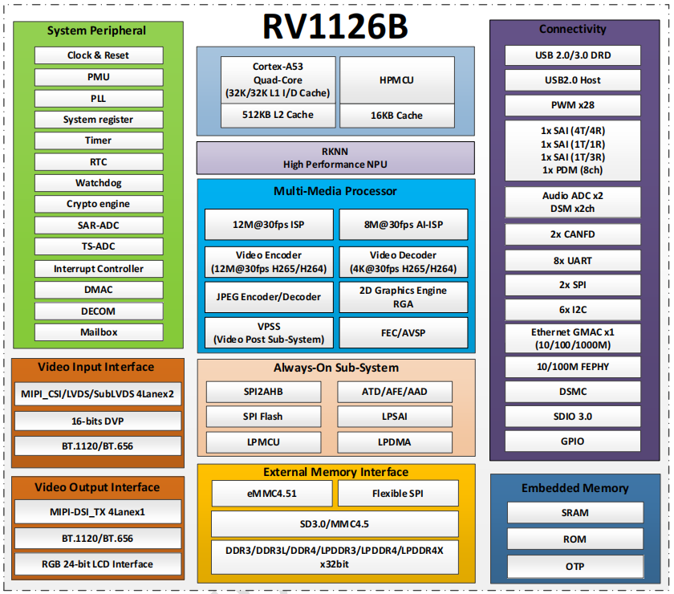

# RV1126B

## 主要特性

- 4K高性能低功耗AI图像处理器
- 四核 ARM Cortex-A53
- 配置 3 TOPS NPU，支持2B以内大模型
- 支持12M@30fps ISP，8M@30fps AI-ISP
- 支持AI Remosaic、PDAF
- 多目AI动态拼接（2*6M 双目拼接/4*2M全景拼接）
- 支持5个摄像头同时输入
- 支持4K@45fps H.264/H.265 编码和4K30解码

## 详细参数 

| Specification | Details |
| :--- | :--- |
| **CPU** | • Quad Cortex-A53 + MCU |
| **GPU** | • 2D Graphics Engine |
| **NPU** | • 3 TOPS |
| **Storage Interface** | • 32bit DDR3L/DDR4/ LP3/LP4/LPAX, eMMC 4.51 |
| **Video Encoder & Decoder** | • Support up to 4K 45fps video encoding• Support H.264/H.265 |
| **Video Input Interface** | • Support 2 x 4lane/ 4 x 2lane/ Thermal Imaging MIPI-CSI Interface• Support DVP interface with BT.656/BT.1120 |
| **Video Output Interface** | • Support 4-lane MIPI DSI interface, up to 1080p@60fps output |
| **ISP** | • 12M@30fps |
| **Audio Interface** | • Integrated Audio codec, 2 * 32-bit ADC, and 16 bit DAC |
| **Peripheral Interface** | • USB3.0 DRD/ USB 2.0 host/ 2xSDIO3.0/ 2xCAN/ DSMC/ RGMII |
| **Package** | • FCCSP 14*14mm |

